# 🖼️ Image Recognition – Urban Wildlife AI

**Image Recognition** is an **AI-powered tool** that uses **deep learning** to understand and identify **objects, animals, and scenes** in pictures—similar to human vision 👁️.  
Trained on **100,000+ images** and capable of recognizing **150+ species**, it is fast ⚡, accurate ✅, and continually improving.  
Applications include **city planning 🏙️, wildlife research 🦊, and public awareness 📢**.

---

## 📌 Scheme

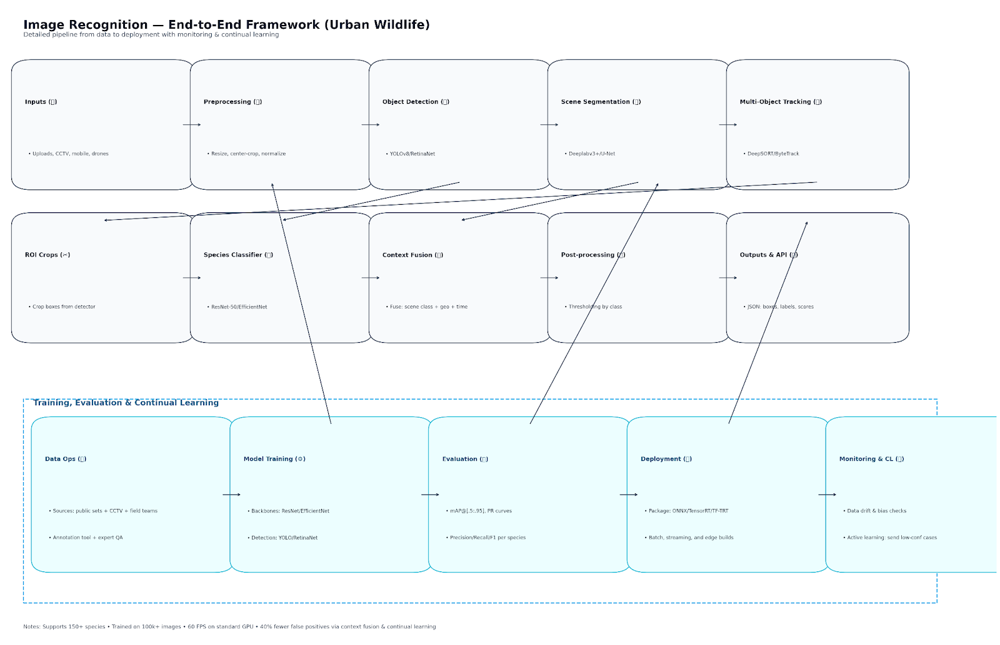

---

## 🛠️ Technical Description
This system uses **Convolutional Neural Networks (CNNs)** to automatically detect features (edges, shapes, textures) and classify them into species or categories.

- 🔍 **Feature Extraction:** CNN layers identify shapes, edges, and structures.
- ⚡ **Activation Functions:** Add non-linearity for complex pattern detection.
- 🧩 **Fully Connected Layers:** Combine features for classification.
- 🔄 **Backpropagation + Optimization:** Continuous learning & accuracy improvements.

The technology applies to **healthcare, security, autonomous driving, and ecology**, making AI capable of interpreting **visual data in context**.

## 🧩 Examples

<table>
    <tbody>
        <tr>
            <td>
                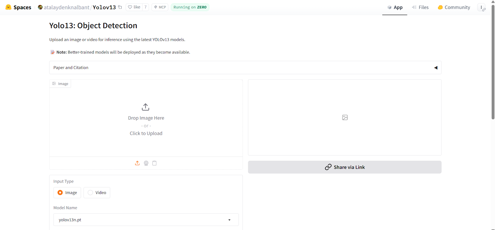
            </td>
            <td>
                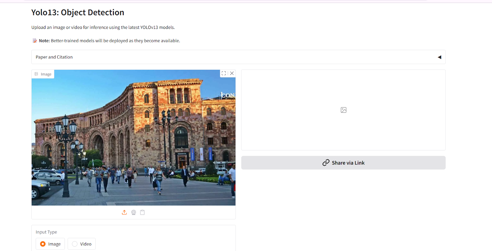
            </td>
        </tr>
        <tr>
            <td>
                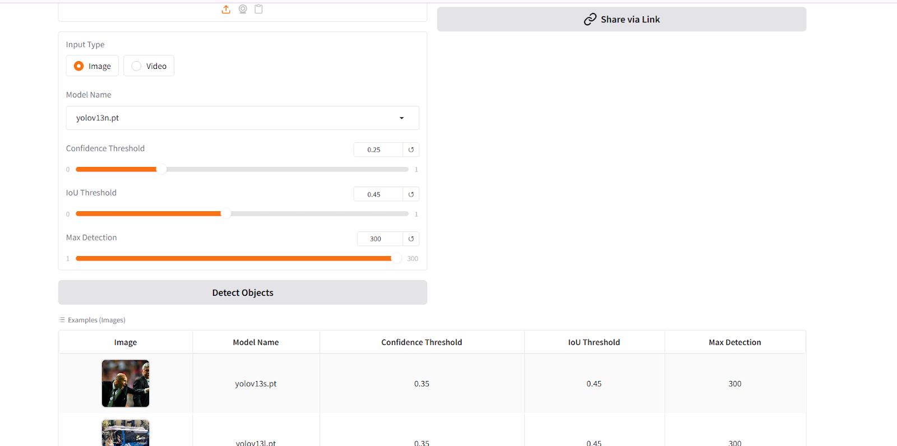
            </td>
            <td>
                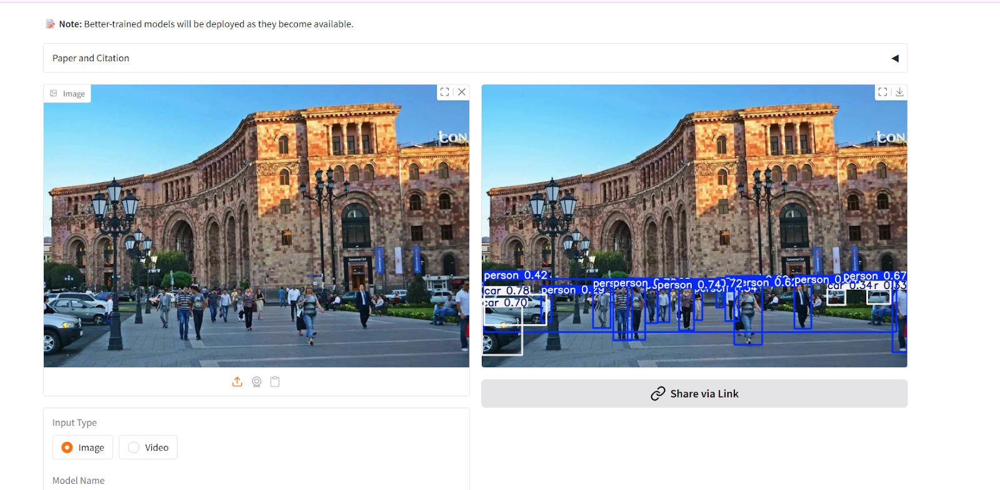
            </td>
        </tr>
    </tbody>
</table>

---

## Examples Demo

<table>
    <tbody>
        <tr>
            <td colspan="2">
                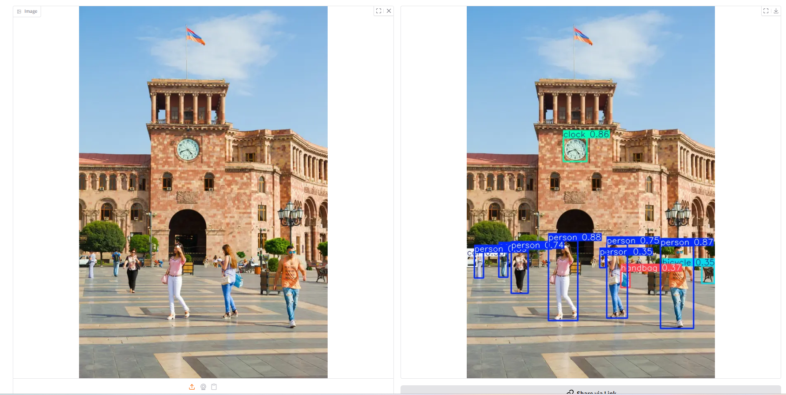
            </td>
        </tr>
        <tr>
            <td>
                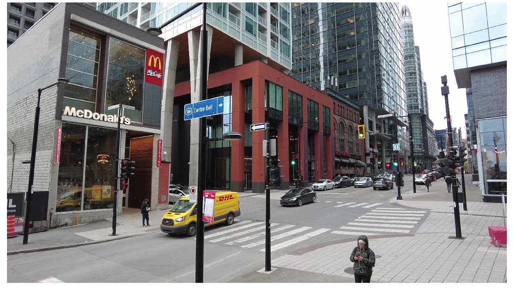
            </td>
            <td>
                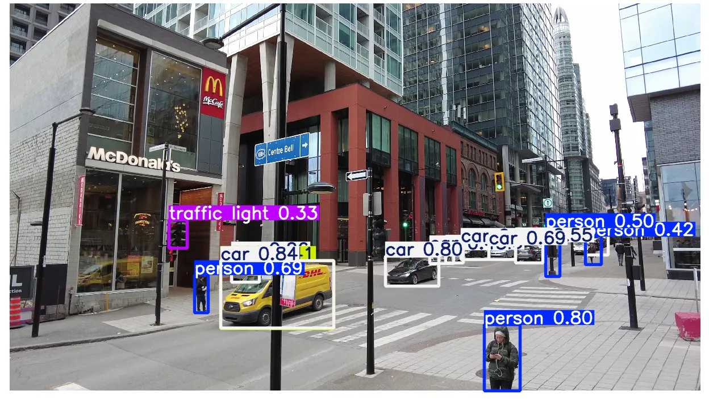
            </td>
        </tr>
        <tr>
            <td>
                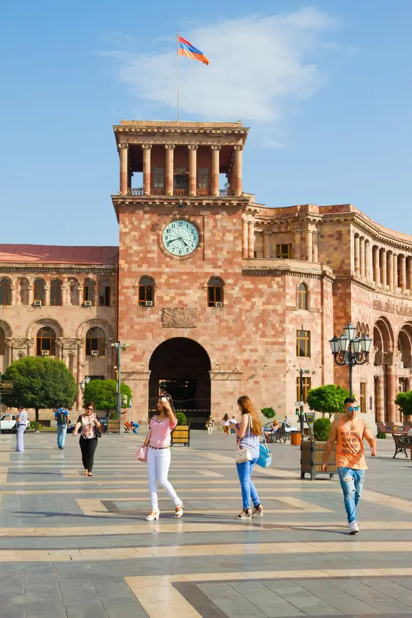
            </td>
            <td>
                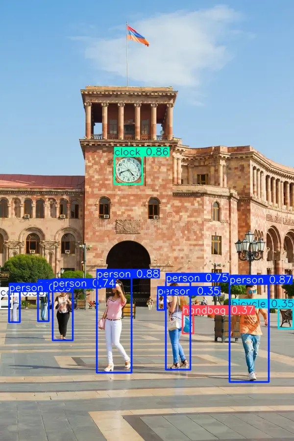
            </td>
        </tr>
        <tr>
            <td colspan="2">
                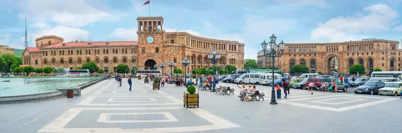
            </td>
        </tr>
        <tr>
            <td colspan="2">
                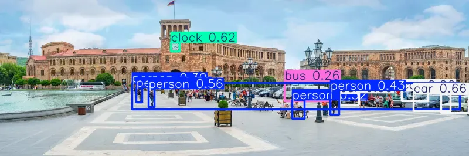
            </td>
        </tr>
    </tbody>
</table>

<table>
    <tbody>
        <tr>
            <td>
                <video src="" controls preload>
                    Your browser does not support the video tag.
                </video>
            </td>
            <td></td>
        </tr>
    </tbody>
</table>

---

## 📖 Full Description

  
📖 Click to expand the Description

### ⚡ Problem
Urban environments are home to diverse wildlife 🐿️🦉🦝.  
Yet, **conventional recognition systems** struggle to identify species in **chaotic cityscapes**, causing:
- ❌ Overlooked species in city planning
- ❌ Weak urban–wildlife preservation
- ❌ Misunderstanding of animal behavior in cities

### 💡 Solution
We built an **AI-driven image recognition system** trained on **urban wildlife datasets** (annotated by specialists).  
It leverages **CNNs (ResNet-50)** to classify species with **high accuracy**, even in **complex urban environments**.

✅ Recognizes 150+ species  
✅ Continuously adapts with new data  
✅ Supports urban planning, research, and public awareness

---

## 🔄 Process

### 1️⃣ Data Collection & Preprocessing
- Sources: Wildlife orgs, urban cameras, open datasets
- Preprocessing: **Resizing, augmentation (rotation, flips, brightness)**
- Goal: Improve **robustness to real-world conditions**

### 2️⃣ Model Selection
- **ResNet-50 CNN** chosen for deep residual learning
- Avoids vanishing gradients & captures complex features

### 3️⃣ Model Training
- Loss: **Cross-entropy**
- Optimizer: **Adam**
- ⚡ **High-performance cluster training**
- Anti-overfitting: Dropout, Weight regularization, Batch normalization

### 4️⃣ Validation & Testing
- Metrics: **Precision, Recall, F1-score**
- Confusion matrices to spot weaknesses
- Validated on unseen datasets

### 5️⃣ Continuous Learning
- Feedback loop from experts & users
- Supports **incremental updates**
- Adapts to **new urban wildlife patterns**

---

## 🏆 Achievements

- 🎯 **94% Accuracy** on validation set
- 🦉 **150+ species recognized** in urban settings
- ⚡ **60 FPS processing speed** for real-time use
- 📸 **100,000+ annotated images** in dataset
- 🔽 **40% reduction in false positives** within 6 months

---

## 🔮 Future Scope

- 🧠 **Advanced Architectures**: EfficientNet, Vision Transformers (ViT)
- 🌦️ **Dataset Diversity**: More weather, time, and environment variations
- 📡 **Edge Computing**: Real-time processing on IoT devices
- 🤖 **Automated Annotation**: Semi-supervised tools with GANs
- 🔄 **Reinforcement Learning**: Smarter continuous updates

---

## 📚 References

1. [Deep Residual Learning for Image Recognition – He et al.](https://example.com/deep-residual-learning)
2. [EfficientNet: Rethinking Model Scaling – Tan & Le](https://example.com/efficientnet)
3. [Vision Transformers for Dense Prediction – Ranftl et al.](https://example.com/vision-transformers)
4. [Generative Adversarial Nets – Goodfellow et al.](https://example.com/generative-adversarial-nets)
5. [Urban Wildlife Conservation: Theory and Practice – McCleery et al.](https://example.com/urban-wildlife-conservation)
6. [CNNs at Constrained Time Cost – He & Sun](https://example.com/cnn-time-cost)
7. [Challenges & Opportunities for AI in Urban Ecology – Johnson & Williams](https://example.com/ai-urban-ecology-review)

---

✨ **This project demonstrates how AI can help humans coexist with urban wildlife, bringing cutting-edge machine learning into city life.** 🚀

